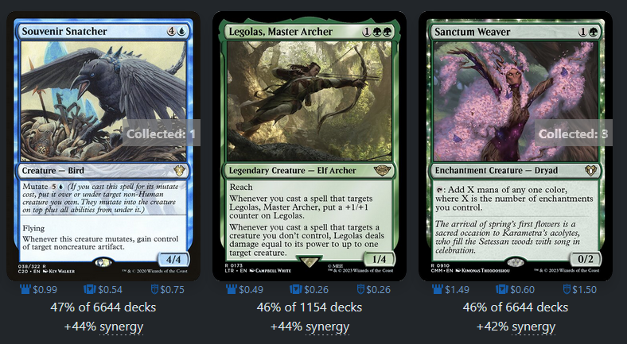
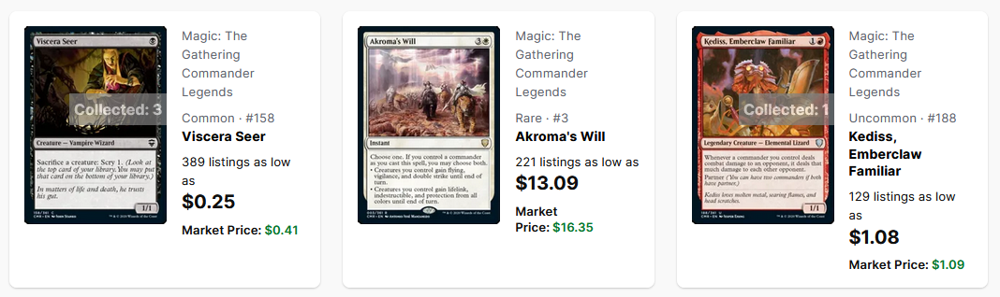
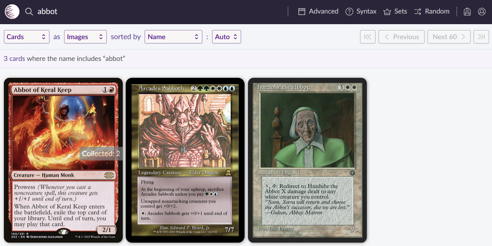

# MTG Card Copies

This is a simple Firefox extension to display the number of copies of each card in a decklist, on a few websites.

The decklist is provided as a simple collection.csv in the plugin directory, usually from deckstats.net export.

  

  

  

Format is:
- First line is ignored (assumed to be header)
- Empty lines are ignored
- Lines are assumed to have values separated by commas
- Values can be optionally enclosed in double quotes
- Commas inside double quotes are ignored
- First value in row is assumed to be the quantity
- Second value in row is assumed to be the card name
- Other values are ignored

Currently only works on EDHREC, TCGPlayer, and Scryfall. Quantities displayed are based solely on the number of cards you have with that NAME. If they are all different versions, that is not taken into account. Each image with that card name will be labeled with the total number.

## Temporary Setup - Firefox

1. In Firefox, navigate to: `about:debugging#/runtime/this-firefox`
2. Click 'Load Temporary Add-on...'
3. Select any file in the extension directory, such as contentScript.js.

## Usage

1. Open your list of extensions and click the button for the MTG Card Copies extension. This will open a config window.
2. Click Browse to find your collection CSV file.
3. Click Load.
4. Don't close the config window until the status message tells you you may, or else your file may not be read in properly.
